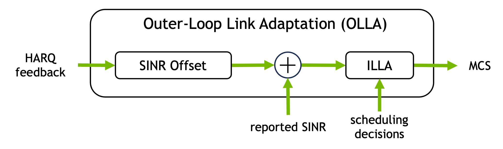
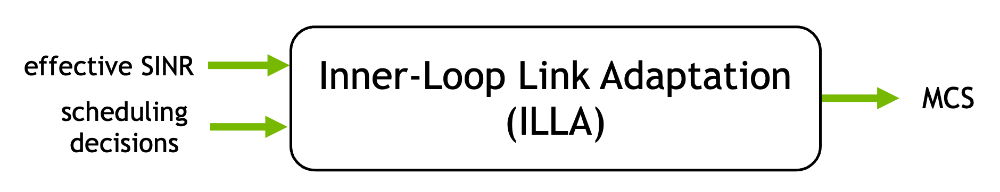

Inner & Outer Loop Link Adaptation Algorithm (ILLA & OLLA)
==========================================================

The outer-loop link adaptation (OLLA) algorithm is the industry standard for
link adaptation in cellular communication systems.
OLLA selects the MCS that meets a target BLER based on pre-computed BLER tables and the latest SINR estimation.
The latter is adjusted by an offset, updated using fixed step-size rules based on the received ACK/NACKs.
This procedure drives the long-term BLER close to the target value.

   OLLA maintains an adaptive SINR offset based on HARQ feedback to achieve target BLER.

The OLLA algorithm uses an inner-loop link adaptation (ILLA) algorithm as a
subroutine, to select the MCS based on the latest SINR estimation and
pre-computed BLER-vs-SINR tables.
The details of the ILLA and OLLA algorithms are presented in the following sections.

   Inner Loop Link Adaptation (ILLA) selects the optimal MCS from pre-computed
   BLER tables, based on the corrected SINR.

In this tutorial, two variants of the OLLA algorithm are implemented:

- *Simple OLLA*: Drives the SINR offset from MAC scheduling statistics (retransmission counters) and looks up the per-MCS SINR threshold from raw BLER-vs-SNR tables (one CSV per MCS). Requires no changes to the OAI gNB MAC.
- *Advanced OLLA* (recommended): Extends the OAI gNB MAC with a per-UE HARQ feedback history list (direct ACK/NACK access) and approximates the BLER-vs-SINR curve with a sigmoid function, allowing for fine interpolation across SINR.

Algorithm Overview
------------------

OLLA operates on the principle of stochastic approximation, where the SINR is
corrected by an offset :math:`\Delta_{\text{offset}}` that is itself updated
based on HARQ feedback as follows:

.. math::

   \Delta_{\text{offset}}^{(t+1)} = \begin{cases}
   \Delta_{\text{offset}}^{(t)} + \Delta_{\text{ACK}} & \text{if HARQ}^{(t)} = \text{ACK} \\
   \Delta_{\text{offset}}^{(t)} - \Delta_{\text{NACK}} & \text{if HARQ}^{(t)} = \text{NACK}
   \end{cases}

where :math:`\Delta_{\text{offset}}^{(t)}` is the SINR offset at time :math:`t`.

The ACK/NACK step sizes :math:`\Delta_{\text{ACK}}` and
:math:`\Delta_{\text{NACK}}` are related to each other via the target BLER
:math:`\tau` (typically, :math:`\tau=0.1`):

.. math::

   \Delta_{\text{ACK}} = \frac{\tau}{1-\tau} \Delta_{\text{NACK}}

The effective SINR is corrected by the offset as:

.. math::

   \text{SINR}_{\text{effective}}^{(t)} = \text{SINR}_{\text{reported}}^{(t)} + \Delta_{\text{offset}}^{(t)}

where :math:`\text{SINR}_{\text{reported}}^{(t)}` is the effective SINR from the most recent CQI report.
Note that, for simplicity, we here use a positive offset formulation, rather than the negative
offset commonly used in the literature.

Finally, the MCS is selected as the highest MCS that does not exceed the target
BLER, according to pre-computed BLER tables and with respect to the effective :math:`\text{SINR}_{\text{effective}}^{(t)}`.
This procedure is commonly referred to as "inner loop link adaptation" (ILLA).

Simple ILLA Implementation
--------------------------
We start with the simple ILLA implementation, which is based on pre-computed tables for the required SNR to achieve the BLER target.

The ILLA module selects the MCS as the highest MCS that does not exceed the
target BLER, according to pre-computed BLER tables and with respect to the
(corrected) effective SINR. These tables are designed to achieve the BLER target for a given MCS and code block size (CBS).

.. literalinclude:: link_adaptation_olla.c
   :language: c
   :start-after: // START marker-illa-simple
   :end-before: // END marker-illa-simple

A limitation with the BLER-vs-SNR tables shipped with OAI is that they are
simulated for only one MCS table index, while 3GPP defines several of them.

The simple OLLA variant works with existing OAI gNB MAC layer without requiring
functional changes.
Thus, the simple OLLA implementation operates solely within the
``get_mcs_from_bler`` function using basic scheduling statistics from
``NR_mac_dir_stats_t *stats``.

.. literalinclude:: link_adaptation_olla.c
   :language: c
   :start-after: float *olla_snr_offset
   :end-before: // Limit the offset range

Advanced ILLA Implementation
----------------------------

As for simple ILLA, the advanced ILLA implementation relies on pre-computed
SINR-vs-BLER tables. Yet, unlike simple ILLA, it supports different table
indices and is based on a finer BLER interpolation against SINR, using the following sigmoid approximation:

.. math::

   \text{BLER}(\text{SINR}) \approx 1 - \frac{1}{1 + e^{\frac{- (\text{SINR} - c)}{s}}}

where :math:`c` is the center parameter [dB] and :math:`s` is the scale
parameter [dB].
Such parameters are pre-computed for each MCS by fitting the BLER vs. SINR
curve obtained via simulations on AWGN channels to the sigmoid function. The
parameters are stored in the file ``bler_sigma_fit.csv``.

The following table shows a few representative sigmoid parameters from
``bler_sigma_fit.csv``. Parameters are derived by fitting the BLER vs. SINR
curves obtained via simulations on AWGN channels with Sionna.

.. csv-table::
   :header: MCS Index, Center c, Scale s
   :widths: 10, 10, 10

   2, -1.91, 0.44
   6, 4.84, 0.51
   10, 8.36, 0.52
   14, 12.20, 0.57
   20, 18.10, 0.69

.. note:: The sigmoid parameters :math:`c` and :math:`s` are pre-computed per MCS through regression fitting. The low regression loss highlights high accuracy for a wide range of BLER target values. However, it might not be accurate enough for very low BLER targets in ultra reliable low latency communications (URLLC).

The ILLA MCS selection scans from the CQI-capped ``max_mcs`` downward, picking
the highest MCS whose target-BLER SINR threshold is below the effective SINR:

.. literalinclude:: link_adaptation_mcs_hist_olla.c
   :language: c
   :start-after: // ILLA: find the largest MCS for which effective_snr > snr_at_target_bler[mcs]
   :end-before: // Update BLER stats

OLLA Implementation
-------------------

The simple OLLA variant uses simple ILLA as subroutine.
Conversely, the advanced OLLA uses advanced ILLA, as well as an enhanced
HARQ feedback, using actual ACK/NACK reports from UE, instead of relying on
aggregated scheduling statistics.
This requires additional changes to the OAI gNB PDSCH scheduler in ``gNB_scheduler_uci.c``:

.. literalinclude:: gNB_scheduler_uci.c
   :language: c
   :start-after: NR_UE_harq_t *harq = &sched_ctrl->harq_processes[harq_pid];
   :end-before: //returns the measured RSRP value

To maintain an MCS history list, direct access to HARQ feedback is provided,
rather than relying on scheduling statistics. The link adaptation function
(``get_mcs_from_bler`` called by the proportional fairness scheduler) then consumes and resets the list
as follows:

.. literalinclude:: link_adaptation_mcs_hist_olla.c
   :language: c
   :start-after: // START marker-print-mcs-history
   :end-before: // END marker-print-mcs-history

OLLA parameters are hardcoded in the header files (``link_adaptation_olla.h`` for simple OLLA, ``link_adaptation_mcs_hist_olla.h`` for advanced OLLA). To modify them, edit and recompile:

.. code-block:: c

   #define OLLA_STEP_SIZE 1.0f     // Adaptation speed
   #define OLLA_TARGET_BLER 0.1f   // Target 10% BLER
   #define OLLA_MIN_MCS 3          // Minimum MCS floor

Implementation Aspects
~~~~~~~~~~~~~~~~~~~~~~

The advanced OLLA implementation includes several key components.
First, the SINR threshold is pre-computed once per ``(MCS table, MCS)`` pair by
inverting the sigmoid fit at the target BLER:

.. literalinclude:: link_adaptation_mcs_hist_olla.c
   :language: c
   :start-after: // START marker-compute-snr-at-target-bler
   :end-before: // END marker-compute-snr-at-target-bler

Further, it includes extended logging for ACK and NACK statistics:

.. literalinclude:: link_adaptation_mcs_hist_log.c
   :language: c
   :start-after: bler_stats->mcs = new_mcs;
   :end-before: LOG_D

This provides detailed statistics on the number of reported ACKs and NACKs, as well as the cumulative first-HARQ iteration throughput normalized by spectral efficiency.

See the :ref:`usage` section for more details on how to use the link adaptation algorithms.

.. _olla_ignore_cqi:

CQI Feedback
~~~~~~~~~~~~

OAI-LA and OLLA depend on CQI (Channel Quality Indicator) reports.
They both use the ``max_mcs`` parameter from CQI feedback to compute the
reported SNR from CQI reports:

.. code-block:: c

   float reported_snr = snr_at_target_bler[mcs_table_idx][max_mcs_allowed];

If the CQI reports are unreliable, it may be preferable to simply ignore them and rely solely on HARQ-based adaptation.
To this aim, you can set ``max_mcs`` to a fixed value (e.g., ``28``) in the code, or set the global constant in ``link_adaptation_mcs_hist_olla.h``:

.. code-block:: c

   #define MAX_MCS_IDX 28

